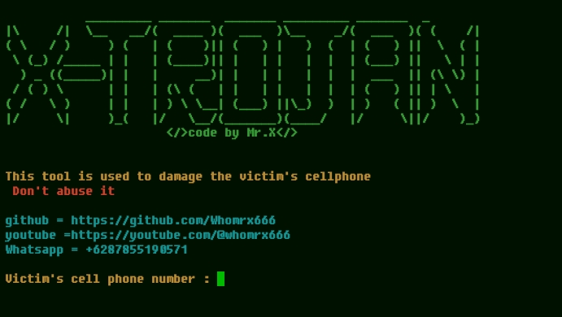

# X-trojan


## introduction
This is a tool for sending a Trojan virus to the victim's cellphone using the victim's telephone number on the victim's cellphone

## Instalations
```
$ pkg update -y && pkg upgrade -y
$ apt update -y && apt upgrade -y
$ pkg install git -y
$ git clone https://github.com/Whomrx666/X-trojan
$ cd X-trojan
$ python2 X-trojan.py
```

## Instructions
- **First**: You must install the tools according to the instructions above
- **Second**: Once installed, enter the victim's telephone number into the tool
- **Third**: After that just click enter
- **Last**: Then the tool will automatically send the Trojan virus to the victim's cellphone
### Original Author
<a href="https://github.com/Whomrx666"></a>

## CONNECT WITH ME :

[](https://whomrxhackers.blogspot.com/)
[](https://twitter.com/whomrx666)
[](https://youtube.com/@whomrx666)
[](https://facebook.com/https://www.facebook.com/whomrx.666)
[](https://t.me/@Whomr_X)
[](https://wa.me/6285933663749)
[](https://www.tiktok.com/@whomr.x)

**If you want to donate, click on the button**
<a href="https://saweria.co/whomrx"></a>

### Visitors :


## Warning
This tool can make the victim's cellphone lag or boot up if the victim's device is not strong enough to withstand viruses or the device is low

